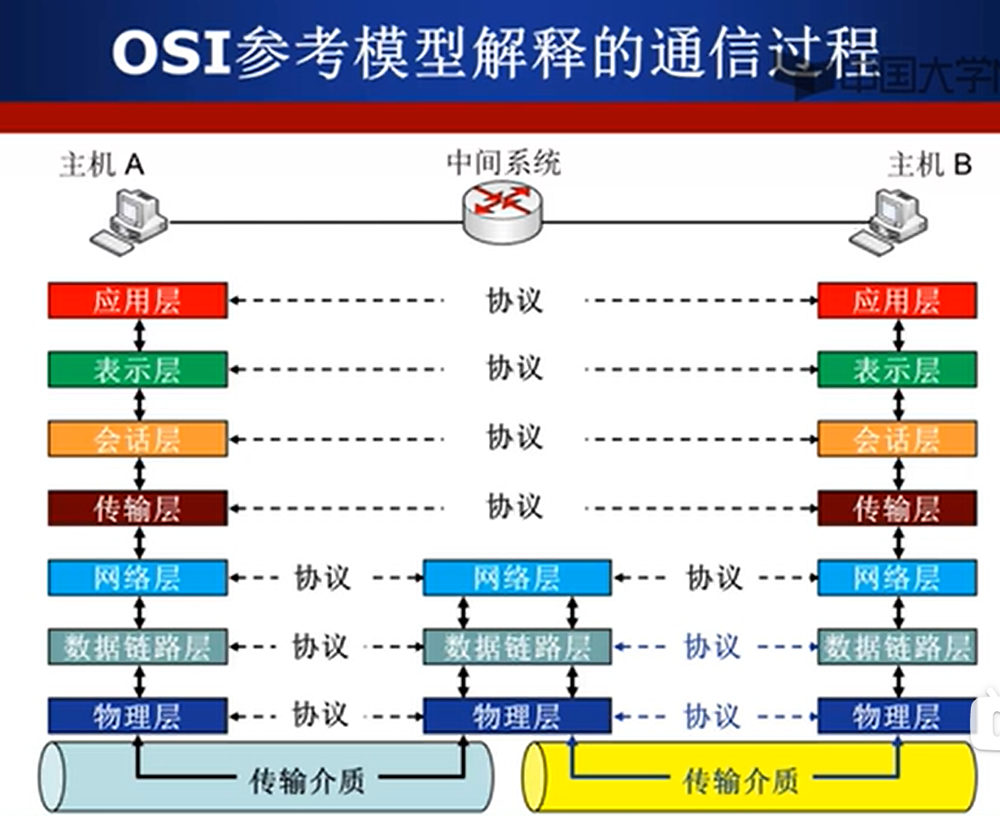
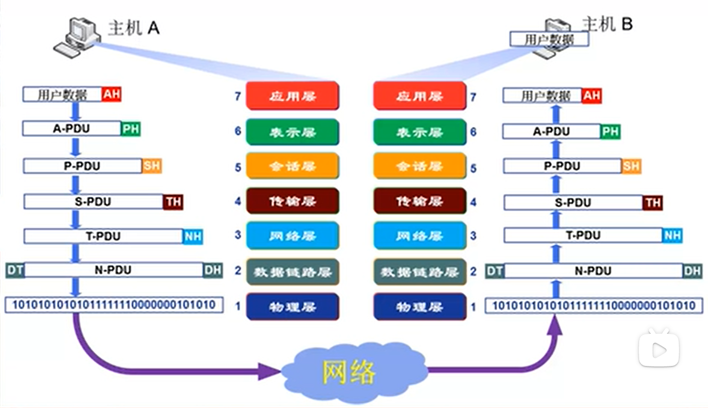
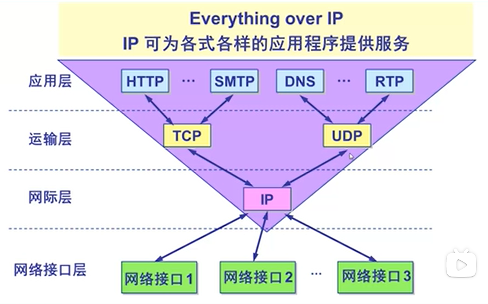
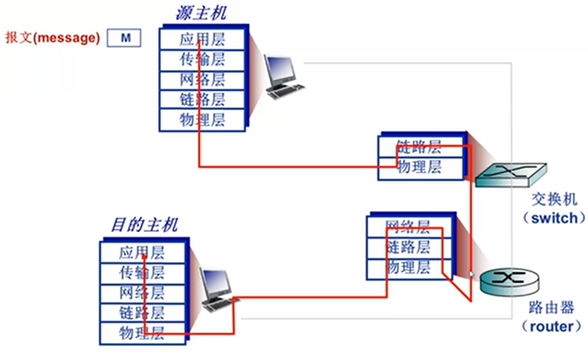

# 计算机网络

## 什么是计算机网络

一些相互连接的、以共享资源为目的的、自治的计算机的集合。

关键点在于连接和自治：连接使得计算机之间可以交换数据；自治是指每台计算机都是一个独立的主体，没有从属关系。

## 什么是网络协议

硬件是计算机网络的基础。

网络协议是计算机之间数据交换所需要的遵守的规则。只有遵守规则，才能保证网络正常运行。网络协议对于计算机网络，就想交通规则对于道路交通一样。

**协议三要素：**

* 语法：信息的格式
* 语义：控制信息及其含义
* 时序：双方通信的时间顺序

## 计算机网络结构

实现计算机之间的互联，最直接的方法是使所有的计算机之间两两连接。这样需要n2条网络连接，每个计算机设备需要连接n-1条网络线路，显然是不可行的。

进一步可以想到使用交换设备（路由器或交换机），所有计算机都连接在交换设备上，这样每个计算机只需要一条连接线路。但是交换设备需要支持连接n条网络线路，只依靠一个交换设备显然也是不可行的。

再进一步可以想到把大量交换设备连接，形成一个交换网络。所有计算机只需要连接在离自己最近的一个交换设备上即可。

更进一步，对交换设备集群进行分级管理。第一级数量较少，但每一个都与第二级若干个交换设备连接；依次类推。计算机只需要连接到离自己最近的末级交换设备即可。

## Internet网络结构

**`ISP:`**互联网服务提供商。

`IXP:` Internet exchange point

`多个一级ISP通过IXP互联。其下可能有二级、三级ISP，之后再与区域ISP连接，由区域IPS连接到主机。`

## 电路交换

数据交换的方式：

电路交换

报文交换

分组交换

三个阶段：

建立连接、通信、释放连接。

## 多路复用

多路复用的几种方式：

* 频分复用：按频率划分不同的段，不同频段之间的数据传输互不影响，如电视频道。
* 时分多路复用：为每个用户分配不同的时间片，用户只能在自己的时隙发送数据。
* 波分多路复用：光的频分复用。
*  码分复用：为不同发送方分配，在对应的接收方用对应的向量解析发送来的分组值。

## 报文交换与分组交换

### 报文交换

以报文为单位进行传输。

### 分组交换

将报文切分成固定大小的分组，以分组为单位进行传输。

分组交换需要进行报文的拆分合并，分组需要添加头部，主要包含一些控制信息。

**分组交换比报文交换传输效率高**

报文交换需要整个报文都到达后才能转发到下一个网络节点。而如果将报文拆分为若干个分组，那么只要一个分组完整到达后，就能发送到下一个节点，此时该报文的其他分组可能还在链路中传输、甚至没有开始传输。

* 如果采用报文传输，那么报文的传输在通信链路中是一个间断的过程，部分报文到达后，还需要等待其余报文完全到达才能进行下一步传输。

* 如果采用分组传输，那么报文的传输在整个链路中类似于一个连续的过程。

假设一个大小为报文为500`kb`，要从A经B、C传输到D，假设从一个节点传输到下一个节点的速率为10`kb/s`。

如果通过报文交换进行传输，那么报文传输时间为50 * 3 s。

如果把报文切分成10`kb`的分组进行传输，那么全部报文传输到D的时间为50 + 2 s。

## 速率、带宽、延迟

### 速率

即数据传输速率，或比特率。单位：`b/s(bps),kb/s,  mb/s, Gb/s`，1， 103, 106, 109； 

### **带宽**

网络带宽通常是数字信道所能传送的“最高数据率”，单位：bps（b/s)；

### **延迟**

延迟四种类型：

* 路由器处理延迟，指服务器处理分组所需要的的时间，一般非常短；
* 排队延迟，分组在路由器中排队的时间，具有不确定性；
* 传输延迟，路由器将分组传输到通信链路所需要的的时间，一般非常短；
* 传播延迟，分组在通信链路中传输的时间，时间长短取决于链路长度和传输速率；

产生排队延迟甚至丢包的原因，分组到达的速率超过了路由器传输分组的速率。当分组到达的平均速率接近路由器传输分组速率时，排队会比较严重，因为分组到达是突发；当分组到达速率大于传输速率时，排队会无限长，甚至经常出现丢包。

## 时延带宽积、丢包率、吞吐率

### 时延带宽积

一段通信链路的带宽`b/s`*分组在该段通信链路的时延`s`；时延带宽积用于表示一段通信链路能够容纳的比特量，是以比特表示链路长度的一种方式。

### 丢包率

丢包数量/发送的总分组数量。

### 吞吐率

从一台主机向另一个主机发送分组的速率。一般常用平均吞吐率和最大吞吐率。

吞吐率取决于两台主机之间的网络链路中带宽最小的链路。多数情况下，吞吐率的瓶颈为两台主机直接接入链路的吞吐率。

## 计算机网络体系结构概述

计算机网络的体系结构采用的是分层结构。

**分层结构的优点：**

* 有利于明确复杂系统的职责；
* 分层结构有利于进行维护、优化；每一层内部功能都是封装好的，对于上一层而言，下一层的功能是透明的，只需要使用，不关心如何实现。下一层的实现进行修改后，对上一层没有影响；

**分层结构的缺点：**

* 层次越多，处理的效率越慢；

**分层结构的一些基本概念：**

**实体：**任何可以发送或接收信息的硬件或软件进程被称为实体。

协议是同一层的实体（对等实体）之间进行通信的规则，是水平的。

每一层的实体都向上一层提供服务，并使用下一层实体的服务。

## `OSI`参考模式

开放系统互联。理论成功、实践失败。

* 应用层
* 表示层
* 会话层
* 传输层
* 网络层
* 数据链路层
* 物理层

通信过程：

OSI模型数据封装与通信过程

**为什么要进行数据封装**

添加控制信息，包括地址信息、差错检验信息等。

## `TCP/IP`参考模型

实践成功

* 应用层
* 运输层
* 网际层
* 网络接口层

## 五层网络模型

综合了$OSI$和$TCP/IP$模型的优点：

* 应用层
* 传输层
* 网络层
* 数据链路层
* 物理层

## 网络应用体系结构

### C/S结构

客户端/服务器结构。服务器存储数据和处理逻辑，等待客户端请求。客户端向服务器发送请求，获取数据或进行业务处理。

服务器一直在线；

服务器需要有固定IP；

实时访问量有突发性；

### $P2P$结构

点对点结构/对等结构。没有明显的服务器和客户端之分，每个主机既可以是服务器也可以使客户端。当主机发送请求时是客户端，接收请求并进行响应时是服务器。

主机可随时上下线；

动态$IP$；

### 混合结构

C/S结构与$P2P$结构的混合。

例：文件搜索使用C/S，文件传输使用$P2P$。

## 网络应用进程通信

同一个主机上的应用进程之间的通信由操作系统处理，不同主机上的应用进程之间的通信主要通过消息（报文）交换的方式进行。

Socket是网络编程中对底层协议的抽象，上连应用，下连网络协议，是网络编程的API。

## 网络应用需求

网络应用对网络传输的需求：

* 可靠性(reliability)/数据丢失的容忍度
* 时间/延迟(delay)
* 带宽(bandwidth)

## WEB应用概述

## HTTP连接类型

### 非持续连接

每个`tcp`连接只发送一个对象。

### 持续连接

每个`tcp`连接可以发送多个对象。

## HTTP消息格式

### 请求消息

内容：

格式：

### 响应消息

内容：

格式：

## Cookie技术

**为什么需要cookie？**

$http$协议是无状态的，但是一些场景需要记录客户端的状态，如购物车等。通过在请求报文和响应报文的报文头中加入Cookie，可以帮助服务器识别客户，并在session中获取客户状态。

**Cookie获取使用过程**

* 客户端第一次访问服务器，cookie为空；
* 服务器发现客户端还没有cookie，则给该客户端分配一个cookie，并在session中记录客户相关状态，之后返回带有cookie的响应报文；
* 客户端接收响应报文，并在之后向服务器发送请求时携带cookie；
* 服务器接收到请求，获取到cookie，根据cookie id找到session中响应的记录，针对性的返回响应报文。

## WEB缓存技术

由于成本问题，一般局域网内部带宽远高于局域网接入核心网络的带宽，如果所有请求都经核心网络，去对应的服务器获取，那么效率会较低，尤其是当响应信息较大时更为明显。而且一般局域网内搜索重复率较高，重复请求会造成资源浪费。因此局域网内一般会建立代理服务器进行缓存。如果请求内容在缓存中存在，则返回缓存中的内容；否则，代理服务器代为向服务器发送请求，并获取响应信息返回给客户端，并将响应信息放入缓存。

**缓存超时问题：**

代理服务器缓存中的内容不一定是最新，如果客户端发出请求时返回过时的报文，显然是不可接受的。因此当客户端请求的内容在缓存中找到时，代理服务器需要向服务器发送一条请求，同时在报文头加上$if-modified-since$报文，用于标识缓存中信息的更新时间。如果自此之后，服务器中的内容也没有进行更新，则直接告知代理服务器未更新（此时报文体为空，报文很小，传输很快）；否则返回最新的响应结果。

## Email应用

email应用发送路径：

发送方-发送方服务器-接收方服务器-接收方。

**协议**

发送方-发送方服务器-接收方服务器使用SMTP协议（推模式）；

接收方服务器-接收方采用$POP/IMAP/HTTP$协议（拉模式）。

## $DNS$

域名服务器（domain name system），完成域名-$ip$地址的映射，是互联网的核心应用。是分层的分布式应用。

由顶级$DNS$服务器-（$com / org / cn$等）

**$DNS$记录**

资源记录（resource record)，格式$name, value, type, ttl$

查询回复协议

## $P2P$

## 传输层

### 基本理论及机制

#### 多路复用

多路复用：多个应用进程公用同一个传输链路，将数据发送到目的主机。

多路分用：传输层将受到的数据通过某些方式（端口号）分解，分别交付给正确的应用进程。

#### 可靠数据传输

##### $rdt1.0$：底层信道完全可靠，没有分组出错和丢失

传输层什么都不用做，接到应用层数据，直接发送即可。

##### $rdt2.0$：底层信道可能会出现分组出错，但不会丢失（不考虑$NAK,ACK$出错）

前提：停等协议，发送方每次发送一个分组，收到接收方反馈才发送下一个分组。

如果想实现可靠数据传输需要实现以下三点：

1. 差错校验，通过在报文头添加校验和来实现；
2. 接收方确认，接收方收到分组且确认没有出错后，向发送方发送$ACK$进行确认，否则发送$NAK$告知发送方分组出错；
3. 发送方重传，发送方如果收到接收方的$NAK$，则重发分组。

另一种方式，也可以只使用$ACK$，但需要对分组添加序号，来进行确认：

1. 差错校验，同上
2. 接收方确认，接收方收到分组并确认没有出错后，想发送方发送$ACK$+期望收到的下一个序号进行确认，否则发送$ACK$+当前序号进行确认；
3. 发送方重传，如果发送方收到接收方发送的$ACK$+当前发送分组序号，则重发该分组。

##### $rdt2.1$：底层信道可能会出现分组出错，但不会丢失（考虑$NAK,ACK$出错）

2.0没有考虑$ACK$分组出错的情况。

如果发送方接收到的确认报文出错，则重新发送当前分组。

##### $rdt3.0$：底层信道可能会出现分组出错和分组丢失

3.0的环境接近于真实环境，分组不仅会出错，而且会丢失（路由器缓存满了，被抛弃）。

由于分组可能会丢失，发送方的分组可能无法到达接收方，接收方的确认报文也可能无法到达发送方。因此：

增加超时重传机制，在发送分组的同时，设置超时定时器，如果超时，则重新发送当前分组。

##### 流水线可靠数据传输协议

$rdt3.0$是一个可用的协议，但是由于它是一个停等协议，因此每次只能发送一个分组，收到确认之后才能发送下一个分组。这样网络信道利用率极低，因此需要一个能够同时发送多个分组的协议，也就是流水线协议。

流水线协议的几个参数：

* 发送窗口(Send Window)：设置发送窗口来规定当前可以发送的分组范围，发送方内包含已接收未确认分组+待发送分组；
* 接收窗口(Receive Window)：设置接收窗口来规定当前等待接收的分组范围。

流水线协议的发送窗口>1，接收窗口>=1;

**回退N步协议($GBN$)**

**选择重传协议($SR$)**

#### 流量控制

#### 拥塞控制

### 传输层协议

#### $UDP$

#### $TCP$

