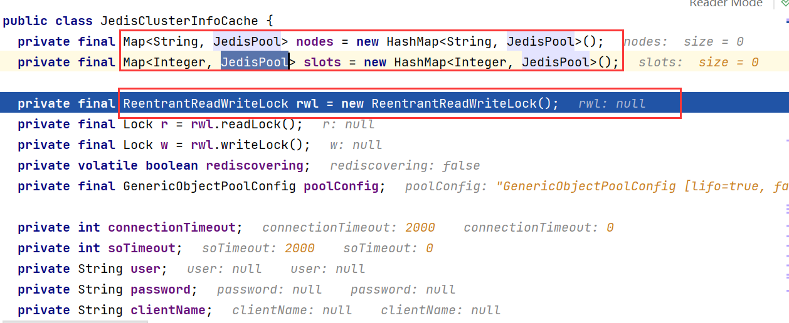

# jedis
## jedis
## jedis-cluster
### jedis-cluster初始化调用栈

```
redis.clients.jedis.JedisCluster#JedisCluster
  redis.clients.jedis.BinaryJedisCluster#BinaryJedisCluster
    redis.clients.jedis.JedisSlotBasedConnectionHandler#JedisSlotBasedConnectionHandler
      redis.clients.jedis.JedisClusterConnectionHandler#JedisClusterConnectionHandler
        redis.clients.jedis.JedisClusterConnectionHandler#initializeSlotsCache
          redis.clients.jedis.JedisClusterInfoCache#discoverClusterNodesAndSlots
            redis.clients.jedis.Jedis#clusterSlots --获取所有的slot信息，list内每个节点信息为起始slot、终止slot、master地址、slave地址
            redis.clients.jedis.JedisClusterInfoCache#setupNodeIfNotExist --创建节点
            redis.clients.jedis.JedisClusterInfoCache#assignSlotsToNode
            
```




JedisClusterInfoCache中的nodes和slots使用的是HashMap，配合ReentrantReadWriteLock保证一致性，用于大量读少量写的场景，相对于使用concurrentHashMap可以显著提升性能。


### jedis-cluster重定向更新slot调用栈

```
redis.clients.jedis.JedisCluster#get
  redis.clients.jedis.JedisClusterCommand#run
    redis.clients.jedis.JedisClusterCommand#runWithRetries --最后一次查询报JedisConnectionException，更新slot信息
      redis.clients.jedis.JedisClusterConnectionHandler#renewSlotCache()
        redis.clients.jedis.JedisClusterInfoCache#renewClusterSlots --需获取写锁后方可更新
          redis.clients.jedis.JedisClusterInfoCache#discoverClusterSlots
```


**TODO LIST:**

* 停止一个master节点，之后查询其他节点slot的信息，查看重定向调用栈
* 停止一个master节点之后，启用多个并发线程持续查询已停止节点slot的值，同时查询其他节点slot的信息，观察重定向操作何时能获取写锁。

